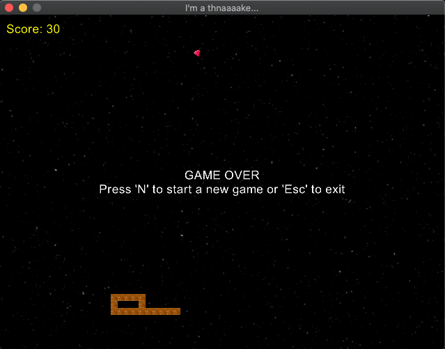

Snake
=====

Remake of the popular game [snake](https://en.wikipedia.org/wiki/Snake_(video_game_genre\))

This game was built using [Gosu](https://github.com/gosu/gosu), which depends on the 
[SDL 2 library](http://www.libsdl.org/).  To play this game, install [Homebrew](http://brew.sh/) and run 
`brew install sdl2`. Then install the gosu gem via `gem install gosu`.  Now you can start the game by running 
`./bin/snake`.

### Game Play

Esc - Exit the game

Cmd-F - Toggle full screen

Use arrow keys to move around. If you hit an edge the snake will wrap around to the opposite side of the screen. 
The game ends when the snake runs into itself. At that point, pressing the 'N' key will start a new game. Enjoy!